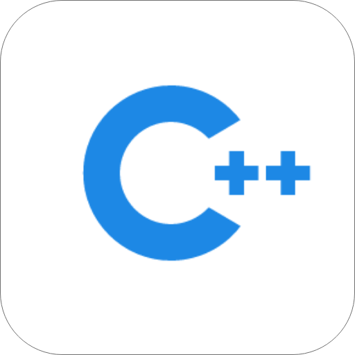
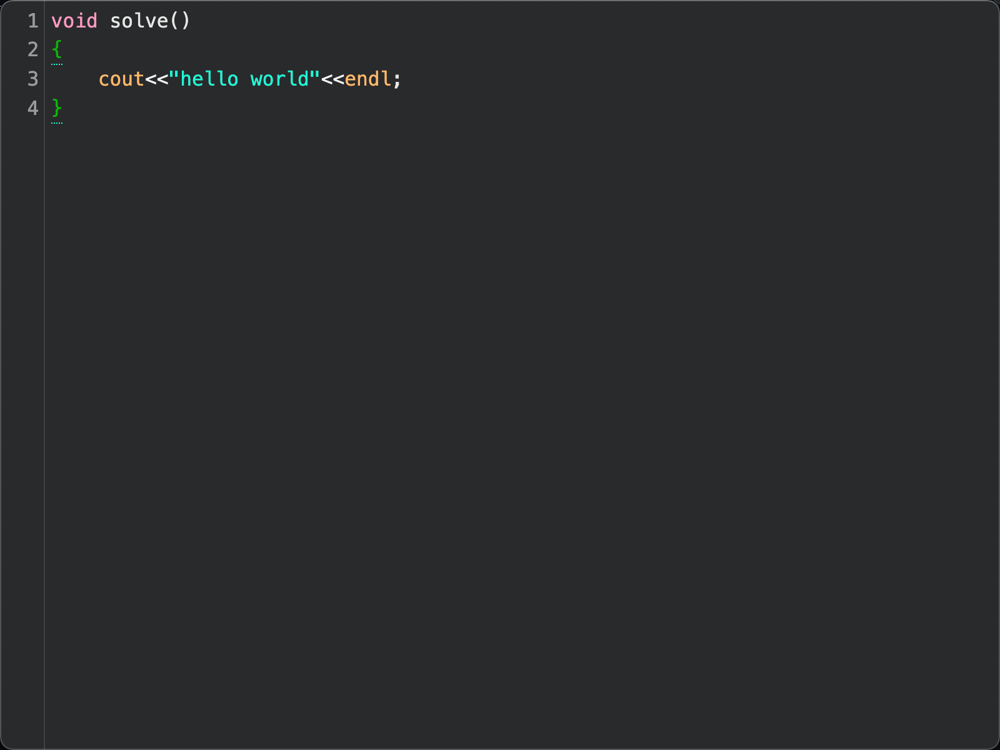
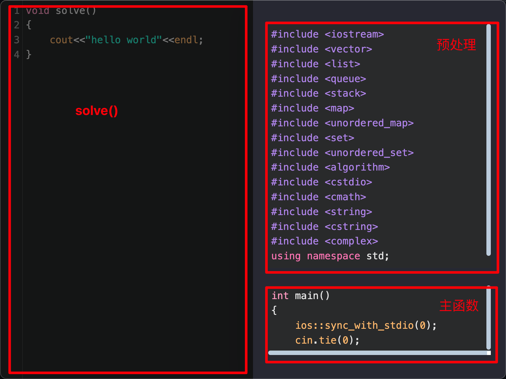
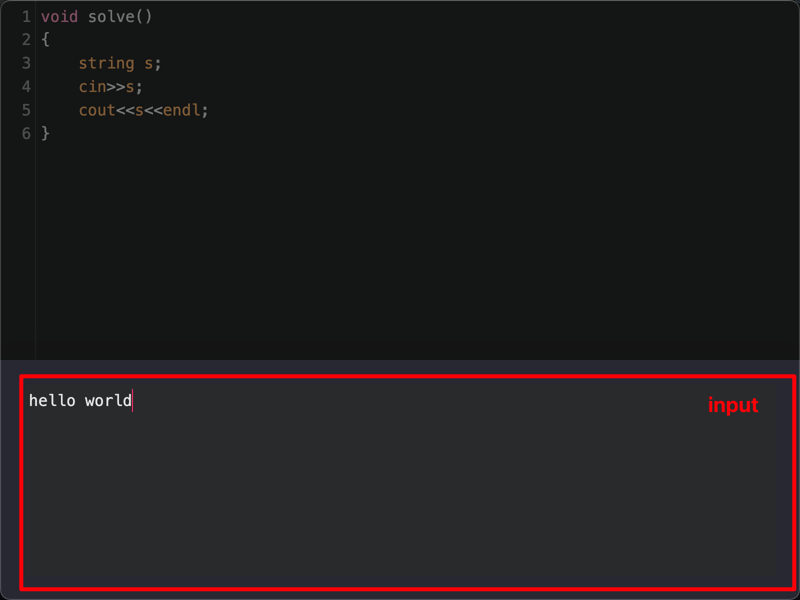
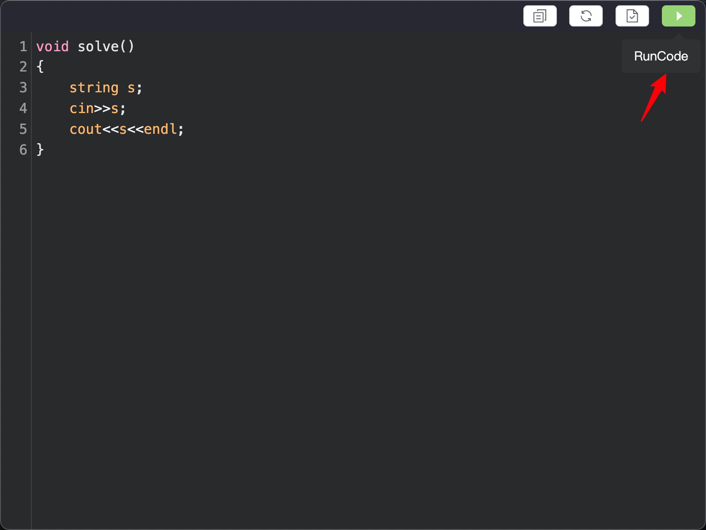
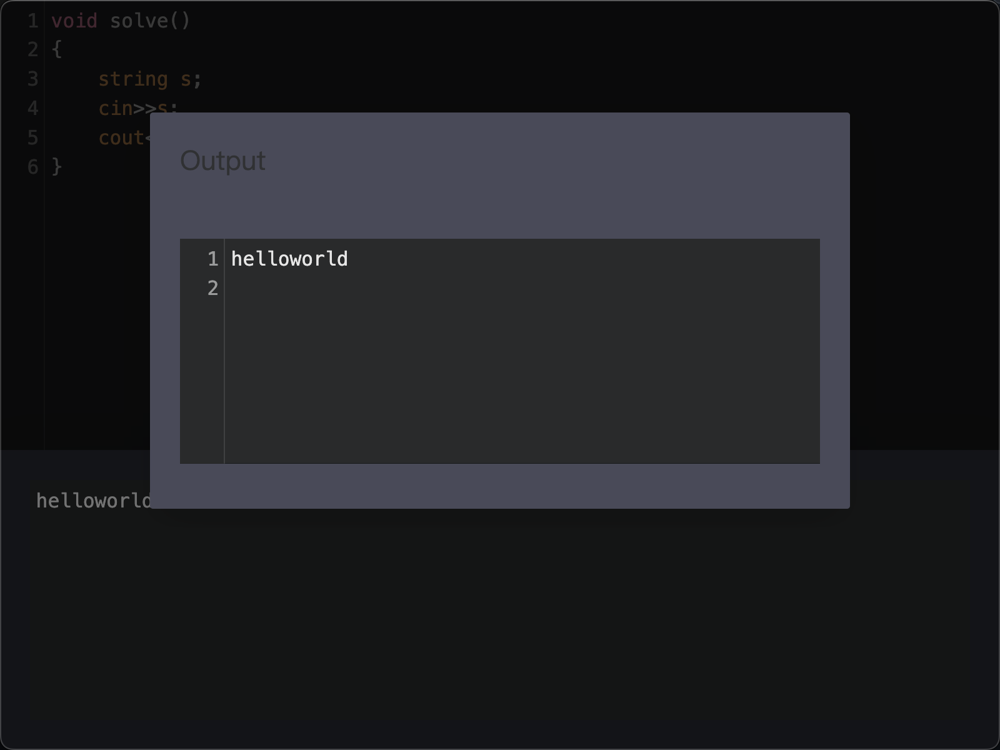
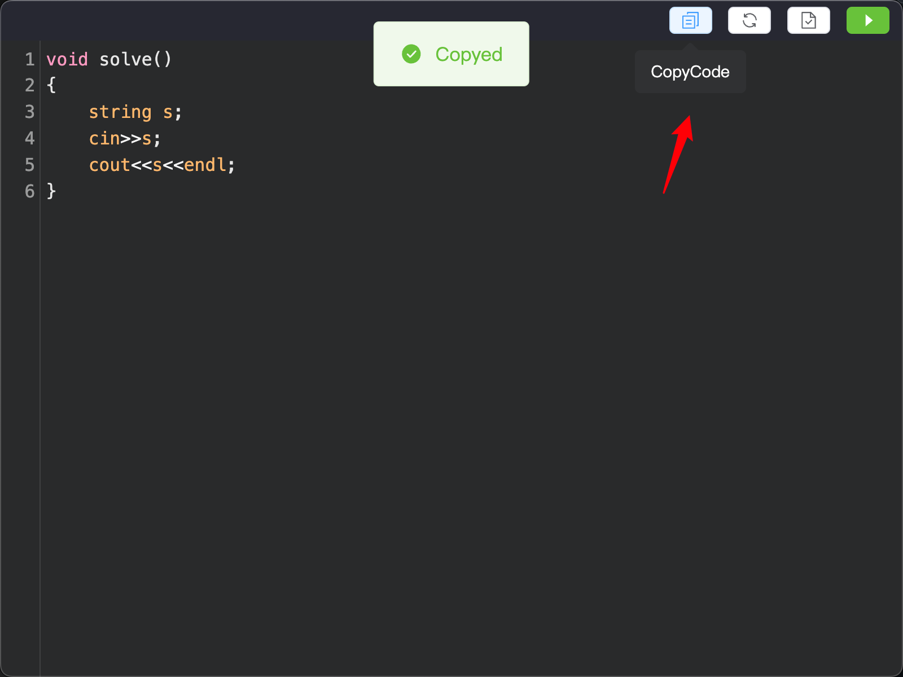
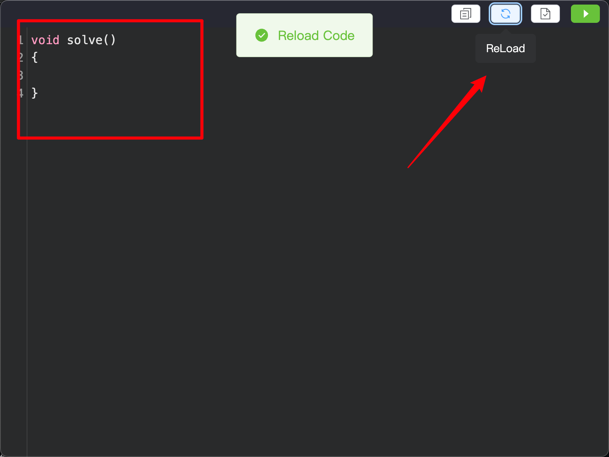
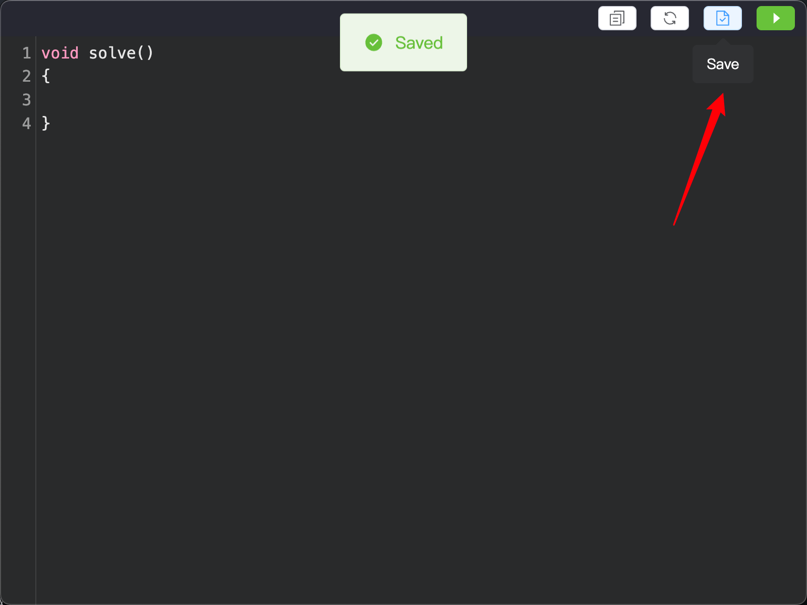

# CPP Runner


> ####  一款面向 OnlineJudge 的 c++ 编辑器


## 功能概述

### 1 代码编辑




为方便使用 OlineJudge, 您的 c++ 代码会被分成三个部分

* 预处理 - {头文件, 算法模版等}
* solve 函数 - 主要代码逻辑,solve()函数会在 main 函数中调用
* main 函数 - {文件操作 , 加速 cin等}

按下快捷键 `cmd + m` 打开右侧抽屉会显示预处理以及主函数代码框



### 2 输入

快捷键 `cmd + d`  打开底部抽屉,可以显示输入框, 即 stdin




### 3 运行

快捷键 `cmd + r` 或点击标签栏(默认隐藏)中运行按钮运行程序





### 4 其他功能

#### 4.1 复制完整代码

当你编写完你的代码准备提交到 OnlineJudge 时, 可以点击标签栏的复制按钮或者按下快捷键 `cmd + o `,即可复制完整的代码.



此时你的剪切板中复制的代码如下:

```c++
#include <iostream>
#include <vector>
#include <list>
#include <queue>
#include <stack>
#include <map>
#include <unordered_map>
#include <set>
#include <unordered_set>
#include <algorithm>
#include <cstdio>
#include <cmath>
#include <string>
#include <cstring>
#include <complex>
using namespace std;

void solve()
{
	string s;
	cin>>s;
	cout<<s<<endl;
}

int main()
{
	ios::sync_with_stdio(0);
	cin.tie(0);
	#ifndef ONLINE_JUDGE
	freopen("/Users/lihaji/Downloads/CppRunner.app/Contents/Resources/cpp/input.txt","r",stdin);
	#endif
	solve();
}
```

#### 4.2 重置代码

点击标签栏重置按钮或者使用快捷键 `cmd + i ` 重置 solve()函数的内容



solve 函数中的内容会被初始化为空

#### 4.3 暂存代码

点击标签栏保存按钮或者使用快捷键 `cmd + s` 即可保存当前的代码, 下次打开 CppRunner 时会重新加载改代码.




### 5 快捷键

- `cmd + r` 运行代码
- `cmd + s` 保存代码
- `cmd + d` 打开输入框
- `cmd + o` 复制完整代码
- `cmd + i` 初始化代码
- `cmd + m` 打开侧边抽屉
- `cmd + t` 隐藏/显示标签栏
- `cmd + w` 隐藏窗口
- `cmd + q` 退出


## 安装 (MacOS)

* release 中下载最新的压缩包解压

* 将 app 移动到 applications 目录下

* 安装 g++

    ```
    brew install g++
    ```

    

## Prject Tree
```
CppRunner
├─ .git
├─ .gitignore
├─ Icon
├─ README.md
├─ assets
├─ cpp
│  ├─ code.cpp
│  ├─ include.cpp
│  ├─ input.txt
│  ├─ main.txt
│  ├─ out
│  └─ solve.txt
├─ electron
│  ├─ main.js
│  └─ preload.js
├─ forge.config.js
├─ images
│  ├─ icon.icns
│  └─ icon.xd
├─ index.html
├─ package-lock.json
├─ package.json
├─ public
│  └─ favicon.ico
├─ src
│  ├─ App.vue
│  ├─ assets
│  │  ├─ base.css
│  │  ├─ logo.svg
│  │  └─ main.css
│  ├─ components
│  │  └─ codeMirrorView.vue
│  └─ main.js
├─ update
└─ vite.config.js

```